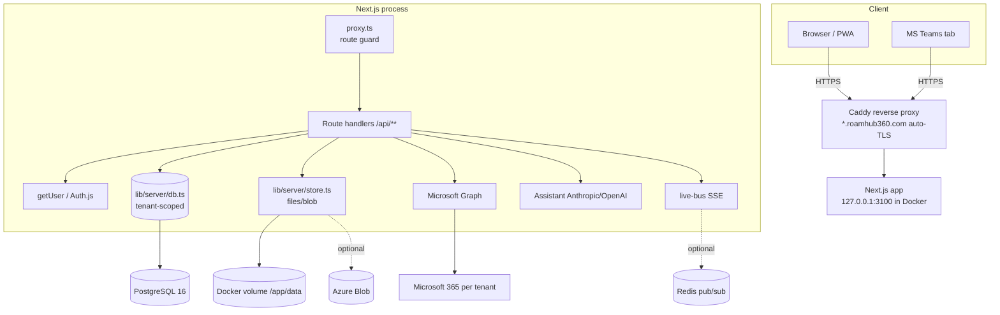
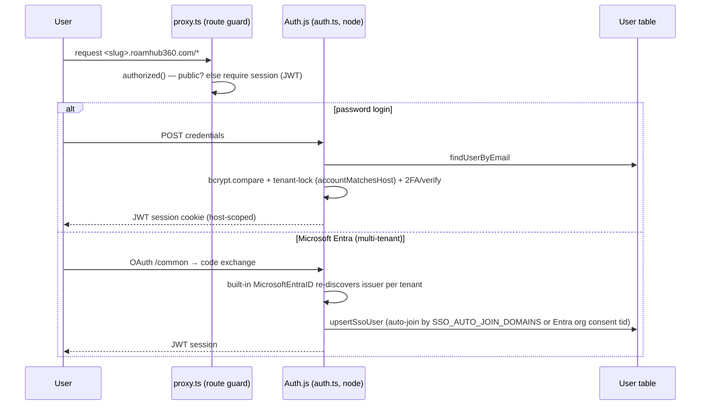
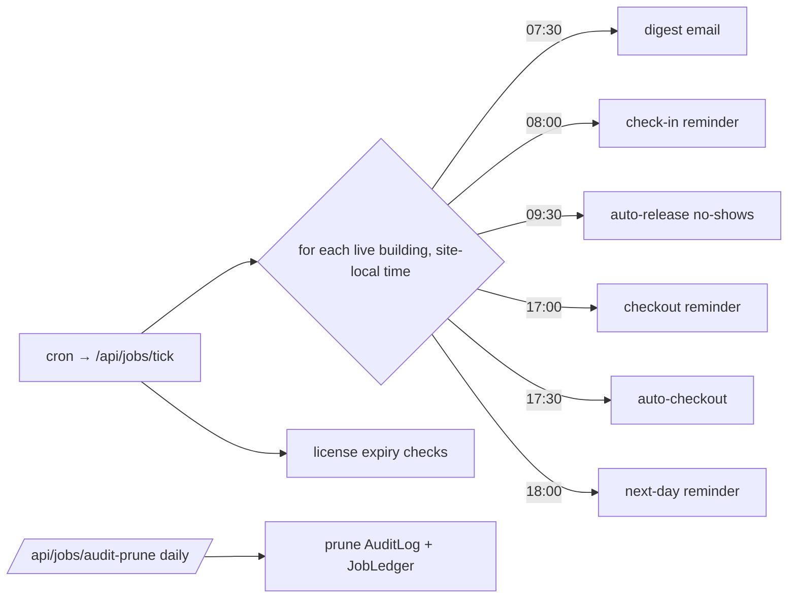
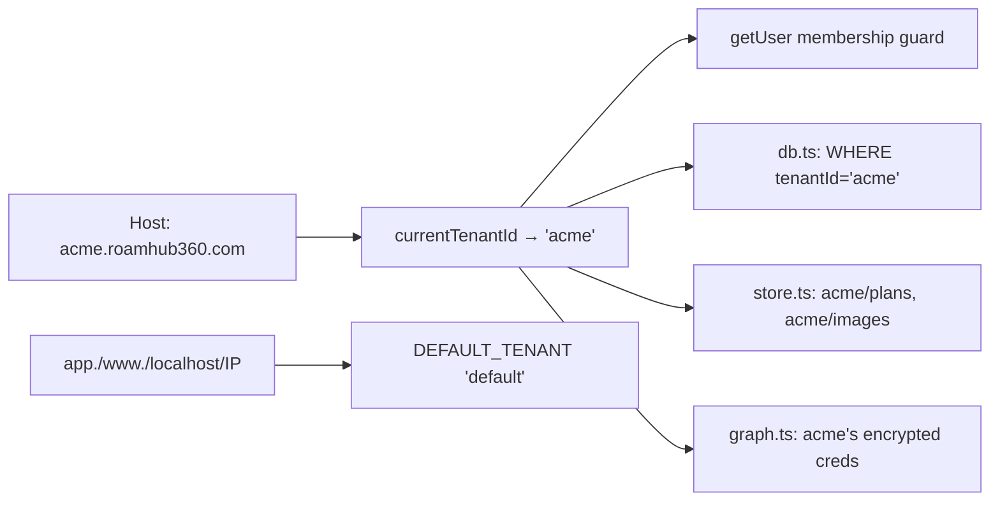

# 02 · Architecture

## Overall architecture

RoamHub360 is a **single Next.js 16 App-Router application** — UI (React Server/Client Components) and
the entire backend (route handlers under `app/api/**`) run in **one Node process** (`node server.js`
from the standalone build). There is no separate API server. Cross-cutting concerns (tenancy, auth,
data access) are centralised in `lib/server/*` "choke-point" modules so that individual routes stay thin.

## Frontend architecture

- **App Router**, React 19. Server Components by default; interactive pages are `"use client"`.
- **Route `params` are Promises** in Next 16 (`const { id } = await params`) — a recurring gotcha; see `AGENTS.md`.
- Layout: `app/layout.tsx` (async — injects per-tenant brand accent server-side pre-paint), `components/app-shell.tsx`, `components/sidebar.tsx` / `components/mobile-nav.tsx` (RBAC-filtered nav from `lib/nav.ts`).
- Data fetching from client components goes through `lib/api.ts` helpers (each wraps `fetch` with consistent try/catch → safe defaults).
- Floor-plan rendering: `components/floorplan/floor-svg.tsx` (SVG geometry), `lib/floorplans.ts`, `lib/plan-scale.ts`.
- Theming: Tailwind 4 tokens in `app/globals.css` (brand palette), `next-themes` light/dark, per-tenant accent override.
- Real-time: `components/live-provider.tsx` holds an `EventSource` to `/api/live`, re-fires `bookings:changed`.
- PWA: `app/manifest.ts`, `public/sw.js` (non-caching service worker + web-push handlers), `components/pwa-register.tsx`.

## Backend architecture

Thin route handlers delegate to `lib/server/*`:

| Concern | Module |
|---|---|
| Identity (server) | `lib/server/auth.ts` → `getUser()` returns `AppUser {role, sites, tenantId, homeTenant, platformAdmin, disabledFeatures, branding}` |
| Tenancy | `lib/server/tenant.ts` → `currentTenantId()` (slug from Host); `lib/tenant-host.ts` (edge+node host→tenant map, apex allowlist) |
| Bookings/checkins/locks/audit data | `lib/server/db.ts` (tenant-scoped; SQL via Prisma or JSON file backend) |
| Prisma client | `lib/server/prisma.ts` (single lazy globalThis-cached client — H5) |
| Files/blobs | `lib/server/store.ts` (Azure Blob or `/app/data`), per-tenant prefixes |
| Microsoft Graph | `lib/server/graph.ts` (per-tenant creds, token cache, timeouts+retry) |
| Assistant | `lib/server/assistant.ts` + `lib/assistant-policy.ts` (tools + system prompt) |
| Licensing | `lib/server/licensing.ts` + `lib/license-state.ts` |
| Rate limiting | `lib/server/rate-limit.ts` (async, in-memory or Redis) |
| SSE bus | `lib/server/live-bus.ts` |
| Audit | `audit()` in `lib/server/db.ts` |

## Database design

Shared PostgreSQL database, **shared-DB + `tenantId`** isolation model. `tenantId` holds the tenant
**slug**. 14 Prisma models (`06_DATABASE.md`). Referential integrity (FK `tenantId → Tenant.slug`) and
row-level security are **designed and prepared** in `prisma/planned/` (C4) but not yet applied.

## Authentication flow

- **Tenant lock:** a sign-in only succeeds on the subdomain matching the account's `tenantId`
  (`accountMatchesHost`); platform operators (`BOOTSTRAP_ADMINS`) are exempt.
- **SSO relay:** cross-subdomain OAuth goes main-host via `/sso/start → /sso/relay → /sso/handoff`.
- Rejections carry machine-readable codes (`bad_credentials|rate_limited|wrong_workspace|unverified|totp_required|totp_invalid`).

## Authorization (RBAC)

Roles: `global-admin`, `site-admin`, `staff` (+ `platformAdmin` = TechHub operator, from `BOOTSTRAP_ADMINS` or the default tenant). Enforced in three places:
1. **Nav** (`lib/nav.ts`) — items carry `roles` / `platform` / `flag`.
2. **Route handlers** — each checks `getUser()` role (e.g. `if (me.role !== "global-admin") 403`).
3. **Membership guard** — `getUser()` refuses access to a workspace that isn't the user's `homeTenant` (platform ops exempt).

Feature flags (CP3): a tenant's disabled feature keys hide nav items AND are enforced server-side (e.g. `/api/presence`, directory sync).

## Booking engine

`lib/booking-rules.ts` (pure, shared client+server): `validateBooking`, `deriveTimes`, `overlaps`, `daysBetween`, `todayInTz`/`nowInTz` (site-local, `DEFAULT_TZ`). Server route `app/api/bookings/route.ts`:
1. Auth + rate-limit; 2. Load authoritative plan (`getStoredPlan`); 3. Ghost-booking check (space must exist on plan); 4. `validateBooking` with the site's tz (past/window/limits); 5. Conflict + lock check; 6. Licence `assertCanWrite` (402 if expired/suspended); 7. Create (tenant-stamped); 8. Optional Graph calendar event (rooms); 9. Email confirmation + push + webhooks + `publishLive`. The AI concierge **never** calls this directly — it only proposes; the client confirms.

## Scheduler / background jobs

`app/api/jobs/[task]/route.ts`, secured by `JOBS_SECRET` (constant-time compare, fail-closed). A cron
hits `/api/jobs/tick` every ~30 min; per **live building** it computes site-local time and runs what's
due at its local 07:30/08:00/09:30/17:00/17:30/18:00:

**Idempotency (H8):** each notification claims a `JobLedger` key (`task:id:localDate`) before sending —
claim → send → release-on-failure — so a duplicate tick can't double-send. State-changers
(auto-release/auto-checkout) are idempotent via status filtering.

## Notification flow

Booking create/edit/cancel/checkin → transactional email (Graph, Resend fallback) + best-effort web
push (`lib/server/push.ts`, VAPID) + outbound webhooks/Slack (`lib/server/webhooks.ts`, SSRF-guarded) +
`publishLive` SSE. Digests/reminders come from the scheduler.

## Email flow

`lib/server/email.ts` builds branded templates (per-tenant `emailBrand(tenantId)`); `lib/server/graph.ts`
`sendMail()` sends from the **single central platform mailbox** (`donotreply@roamhub360.com`) via Graph,
falling back to **Resend** (`lib/server/mailer.ts`) if configured/needed. Emails are **redacted in logs** (M7).

## Calendar flow

Room bookings create a Graph calendar event on the room mailbox (per-tenant Graph creds); cancel deletes
it. `ROOM_MAILBOXES` / plan `mailbox` map spaces → mailboxes. Windows timezone derived via `lib/timezones.ts`.

## Teams integration

`teams/manifest.json` defines a personal + configurable "Who's in" tab. `app/teams/*` bridges via
teams-js; **Teams SSO** uses a credentials provider verifying the getAuthToken token server-side in
`lib/server/teams-token.ts` (jose vs Microsoft JWKS, audience/issuer checks).

## Microsoft Graph integration

Per-tenant (Commercial SaaS CP1): the **default/demo** tenant uses env `GRAPH_*`; every customer tenant
uses its own **encrypted** `TenantIntegration` (AES-256-GCM, `lib/server/crypto.ts`). `graph.ts` resolves
creds per tenant, caches tokens per tenant, and every call has a 12s timeout + one retry (M5). Used for
mail, room calendar events, and directory sync (`lib/server/directory.ts`).

## Audit logging

`audit(actor, action, detail?, ctx?)` writes to `AuditLog` (append-only; M3). Auto-captures IP /
user-agent / request-id from ambient headers; optional `{target, before, after}` for privilege changes
(e.g. user role change). Retention prune + CSV export (`/api/audit?format=csv`, injection-guarded).

## Licensing architecture

`License` row per tenant (tier, maxSites, maxFloorsPerSite, status, expiry, grace). `lib/license-state.ts`
(pure) computes active/grace/expired/suspended + readOnly. Enforced server-side (402): buildings POST
(site allowance), floors PUT (floor cap), bookings POST (read-only when expired/suspended). Default
tenant + dev = unlimited. Expiry notices (90/60/30/14/7/1/0-day bands) via the scheduler (CP4).

## Multi-tenant architecture

Tenant resolved from subdomain (apex/reserved → `default`). Data scoped in `db.ts`; storage prefixed in
`store.ts`; Graph creds per tenant. `Tenant` table holds slug/name/status/features/branding.

## Data flow (a booking)

Browser `/book` → `createBookingApi` (`lib/api.ts`) → `POST /api/bookings` → validate + licence + conflict → `createBooking` (db.ts, tenant-stamped) → Graph event (rooms) → email/push/webhook/`publishLive` → SSE → other clients refresh.

## API flow (public v1)

`GET /api/v1/bookings` → `apiGuard(req, "read")` (`lib/server/api-v1.ts`) → `verifyApiKey` (tenant-scoped, expiry+scope) → per-key rate limit → tenant-scoped data via `db.ts` → JSON.
