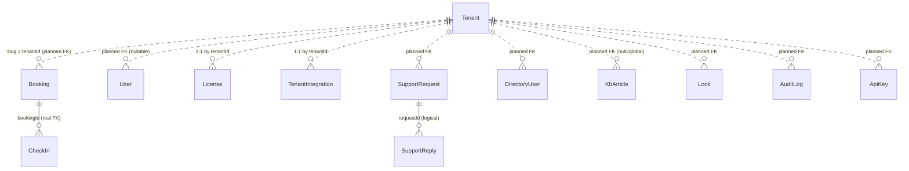

# 06 · Database

## Provider

**PostgreSQL 16** (self-hosted in Docker on the droplet; `db` service in `docker-compose.cohost.yml`).
Prisma datasource `provider = "postgresql"`, connection via `DATABASE_URL`. (Historically Azure SQL /
sqlserver — since migrated to Postgres.)

**Dual backend:** when `DATABASE_URL` is **unset** (local dev), `db.ts` and most `lib/server` modules
fall back to a **JSON/file backend** under `data/` (gitignored). This is why the app runs locally with
no database. Production always sets `DATABASE_URL`.

## Migrations (H6)

- Baseline migration: `prisma/migrations/00000000000000_init/migration.sql` (all 14 tables, generated
  from the schema). Applied by `prisma migrate deploy`.
- The container's **migrator** (`scripts/migrate.sh`) runs `migrate deploy` and **self-baselines** a
  database that predates migrations (created by the old `db push`): on `P3005` it does a one-time
  `db push` to reconcile, marks the baseline applied, then deploys. See `prisma/migrations/README.md`.
- Author new migrations locally with `npm run db:migrate:new -- --name <x>` (commit the SQL).

## Prisma models (14)

`Tenant`, `Booking`, `CheckIn`, `Lock`, `AuditLog`, `ApiKey`, `JobLedger`, `License`,
`TenantIntegration`, `DirectoryUser`, `User`, `KbArticle`, `SupportReply`, `SupportRequest`.

### Tenancy note
`tenantId` on scoped tables holds the tenant **slug** (e.g. `"default"`, `"acme"`), NOT a FK to
`Tenant.id`. FK integrity (`tenantId → Tenant.slug`) + Postgres RLS are **prepared but not applied**
(`prisma/planned/01-tenant-fk.sql`, `02-tenant-rls.sql`; C4). `User.tenantId` and `KbArticle.tenantId`
are **nullable** (null = unassigned / global KB article).

## Relationships (ERD)

Only **CheckIn → Booking** is a real DB foreign key today (`CheckIn_bookingId_fkey`). Everything else is
tenant-scoped in application code.

## Table details

- **Tenant** — `id` (uuid PK), `slug` (**unique**), `name`, `status` (active|trial|suspended),
  `features` (disabled feature keys), `brandName/brandAccent/brandLogo` (white-label), `createdAt`.
- **Booking** — `id`, `tenantId`, `userEmail`, `bookedByEmail?` (on-behalf), `buildingId`, `spaceKey`,
  `spaceLabel`, `kind` (desk|office|room|parking), `durationType` (hourly|half|full), `start`/`end`
  (**site-local wall-clock strings** `YYYY-MM-DDTHH:mm`), `status` (Booked|Checked in|Cancelled|Declined),
  `eventId?` (Graph), `cancelledBy?`/`cancelReason?`, `createdAt`. Indexes: `(buildingId,spaceKey)`,
  `(userEmail)`, `(tenantId)`.
- **CheckIn** — `id`, `tenantId`, `bookingId` (**FK → Booking**), `date`, `checkedInAt?`, `checkedOutAt?`.
  Unique `(bookingId, date)` (multi-day desks check in daily).
- **Lock** — composite PK `(tenantId, buildingId, spaceKey)`; `scope` (temporary|permanent), `lockedBy?`.
- **AuditLog** (append-only, M3) — `id`, `tenantId`, `at`, `actor`, `action`, `detail?`, `ip?`,
  `userAgent?`, `requestId?`, `target?`, `before?`, `after?`. Indexes `(tenantId)`, `(tenantId,at)`, `(at)`.
- **ApiKey** (H2) — `id`, `tenantId`, `name`, `prefix`, `hash` (**unique**, SHA-256), `scopes[]`
  (default `["read"]`), `createdAt`, `createdBy`, `lastUsedAt?`, `expiresAt?`. Indexes `(tenantId)`, `(hash)`.
- **JobLedger** (H8) — `id`, `key` (**unique**, `task:id:localDate`), `task`, `at`. Index `(at)`. Idempotency.
- **License** (CP2) — PK `tenantId`; `tier`, `maxSites`, `maxFloorsPerSite`, `status`, `startsAt?`,
  `expiresAt?`, `graceDays`, `notes?`, `notifiedThresholds[]` (expiry bands emailed), timestamps.
- **TenantIntegration** (CP1) — PK `tenantId`; `azureTenantId?`, `graphClientId?`, `secretEnc?`
  (AES-256-GCM, write-only, never returned), `mailFrom?`, `ssoEntraTenantId?` (**unique**, org-consent),
  `ssoConnectedAt?/By?`, `directoryGroups[]` (sync scope), last-test fields, timestamps.
- **DirectoryUser** (Team Build-Up B) — cached Graph directory per tenant; unique `(tenantId, email)`;
  displayName/givenName/surname/jobTitle/department/officeLocation/managerEmail/photo (data URL)/syncedAt.
- **User** — `id`, `email` (**unique**), `name?`, `passwordHash?` (null=SSO-only), `role`
  (global-admin|site-admin|staff), `sites[]`, `multiBook`, `provider`, `tenantId?` (nullable),
  `hidePresence`, `notifyPresence`, `emailVerified?`, `mustVerify`, `totpSecret?`, `totpEnabled`, `createdAt`.
- **KbArticle** — `id`, `tenantId?` (**null = GLOBAL/platform article shown in every workspace**), `slug`,
  `title`, `summary?`, `category`, `body` (markdown), `published`, `pinned`, `sort`, `views`, `createdBy?`,
  timestamps. NOTE: built-in help also ships **in code** (`lib/kb-content.ts`) — DB articles are optional add-ons.
- **SupportRequest** — `id`, `tenantId`, `userEmail`, `userName?`, `category`, `subject`, `message`,
  `status` (open|closed), `priority`, attachment metadata (bytes live in `store.ts`), `adminNote?`,
  `requesterReadAt?`, `adminReadAt?`, timestamps.
- **SupportReply** — `id`, `requestId` (logical link to SupportRequest), `authorEmail`, `authorName?`,
  `fromAdmin`, `body`, attachment metadata, `createdAt`. Index `(requestId)`.

## Seed / demo data

- **First admin:** `node scripts/create-admin.mjs <email> <pw> [name]` (needs `DATABASE_URL`) — also
  ensures the `default` Tenant row. On the droplet: `docker compose … run --rm migrate node scripts/create-admin.mjs …`.
- **Demo floor plans/bookings** live in local `data/*.json` (gitignored) — NOT in the repo; a hosted
  demo needs them created via the editor UI or seeded into the volume.
- **KB content** is built-in via `lib/kb-content.ts` (no seeding needed).

## Booking / User / Building / Floor / Licence model relationships

- A **Building/site** is not a SQL table — buildings + floor-plan geometry live in **storage** (`store.ts`
  → `getStoredPlan(buildingId)`, `listCustomBuildings`), keyed by `buildingId` (`<root>` or `<root>__floor-N`).
  A "floor" is a plan under a building root. Timezone (`plan.tz`) lives on the plan.
- **Bookings** reference buildings by `buildingId` + `spaceKey` (string), validated against the plan.
- **Licence** limits are per-tenant and cap **sites** (buildings) and **floors per site**.
