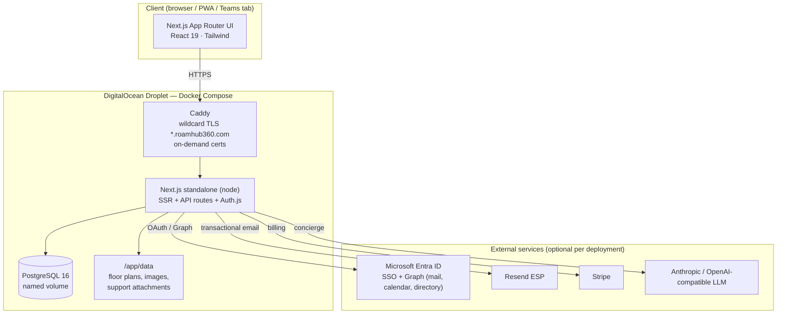
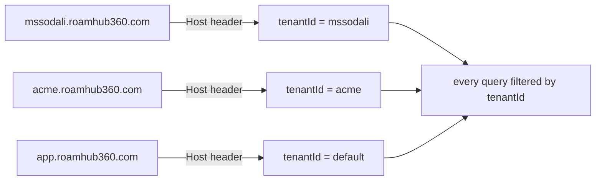
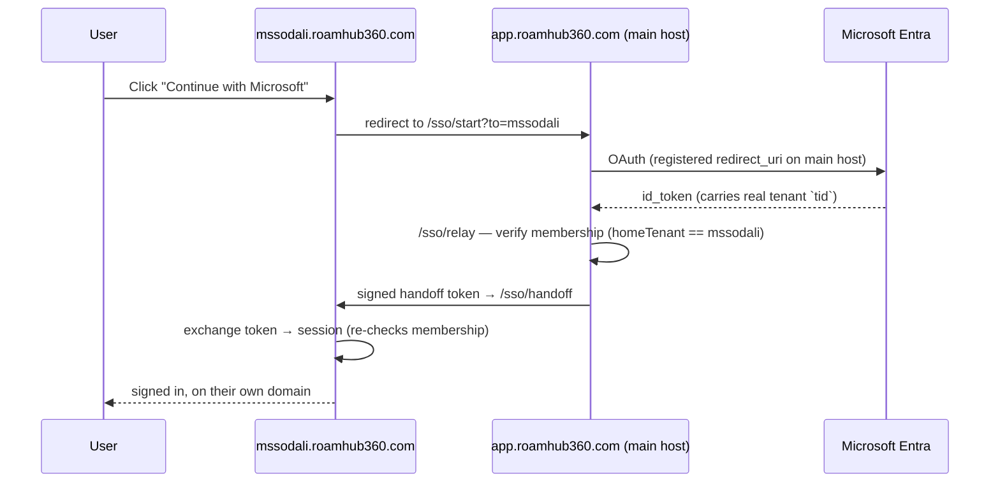
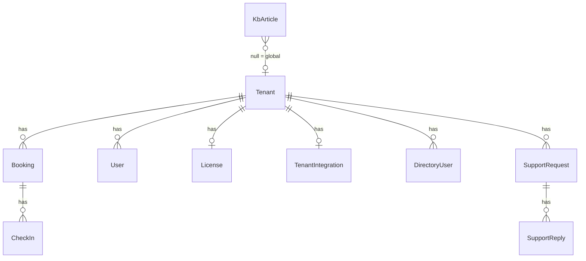
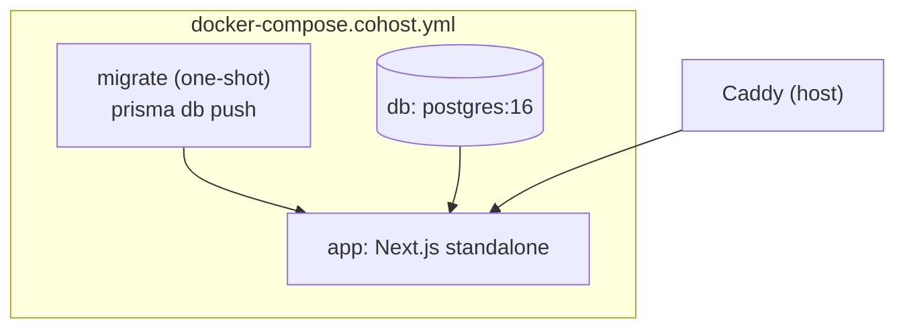

# RoamHub360 — System Overview

**A multi-tenant workspace-booking SaaS** (desks, meeting rooms, private offices, parking) with team-presence, Microsoft 365 integration, an in-app help centre and support desk. A TechHub Australia product.

> **Status:** Live in production. Phase-1 customer (`mssodali`) onboarded via Microsoft SSO.
> **This document** is a technical overview for architecture / security review. Generated from the codebase at commit `699e30c`.

---

## 1. At a glance

| | |
|---|---|
| **Product** | RoamHub360 — smart workspace booking for hybrid teams |
| **Type** | Multi-tenant B2B SaaS, subdomain-per-customer |
| **Stack** | Next.js 16 (App Router) · React 19 · TypeScript · Prisma 6 / PostgreSQL 16 · Tailwind 4 |
| **Auth** | Auth.js v5 (JWT sessions) — Microsoft Entra SSO (multi-tenant) + Google + email/password |
| **Hosting** | Single DigitalOcean droplet, all-in-Docker, behind Caddy (wildcard TLS) |
| **Source size** | ~20,750 lines of app/component/lib TypeScript |
| **Tests** | 121 unit test cases across 19 files (Vitest) |
| **Page routes** | 33 · **API routes** 70 |
| **Data model** | 12 Prisma models |

---

## 2. Technology stack

| Layer | Technology | Version | Notes |
|---|---|---|---|
| Framework | Next.js | 16.2.9 | App Router, standalone output, Turbopack. **Non-standard**: route `params` are Promises; see `AGENTS.md`. |
| UI runtime | React | 19.2.4 | |
| Language | TypeScript | strict | |
| Auth | next-auth (Auth.js) | 5.0.0-beta.31 | JWT strategy, split edge/node config |
| ORM | Prisma | 6.19.3 | `prisma db push` (no migration files) |
| Database | PostgreSQL | 16-alpine | In-Docker, named volume |
| Styling | Tailwind CSS | 4 | Token-driven (CSS custom properties), light/dark |
| Validation | Zod | 4.4.3 | Request-body validation on API routes |
| Billing | Stripe | 22.3.0 | Optional; `BILLING_PROVIDER=stripe` |
| Email | Microsoft Graph **or** Resend | — | Central sender for all platform mail |
| Blob/file store | Azure Blob **or** local disk | 12.32.0 | `putAsset`/`getAsset`, tenant-scoped |
| Push | web-push (VAPID) | 3.6.7 | Optional device push |
| Password hashing | bcryptjs | 3.0.3 | |
| AI concierge | Anthropic **or** any OpenAI-compatible | — | "Hubbi" assistant, optional |

---

## 3. System architecture

**Key points**
- **Single deployment serves all tenants.** Isolation is logical (per-row `tenantId`), not per-instance.
- **Caddy** terminates TLS with an on-demand wildcard cert for `*.roamhub360.com`, so a new customer subdomain needs no cert provisioning.
- The app runs as a **Next.js standalone** node process; Postgres and the app share the droplet via Docker Compose (`docker-compose.cohost.yml`).
- **Binary assets** (floor-plan images, support attachments) live on a persistent volume via a storage abstraction that also supports Azure Blob for cloud deployments.

---

## 4. Multi-tenancy model

Each customer is a **workspace** identified by a slug, reached at `<slug>.roamhub360.com`. The main host `app.roamhub360.com` maps to the reserved `default` tenant (TechHub's own / the platform-operator surface).

- **`currentTenantId()`** derives the tenant from the request Host (via `lib/tenant-host.ts`, shared with the edge middleware).
- **Every table** carries a `tenantId`; all reads/writes are scoped to it. Cross-tenant reads are prevented at the data-access layer and re-checked in the auth guard.
- **Cookies are host-only per subdomain** (Auth.js default, no cookie domain set) — a session on one workspace is not visible on another.
- **Feature flags** (`presence`, `directory`, `digest`, `assistant`) are toggled per tenant by the platform operator; disabled features disappear from that customer's app.
- **White-label**: per-tenant product name, accent colour and logo (`Tenant.brandName/brandAccent/brandLogo`).

---

## 5. Authentication & authorization

The most intricate part of the system. Auth.js v5 with a **split config**: `auth.config.ts` (edge-safe, used by middleware) and `auth.ts` (Node runtime, providers + DB logic).

### 5.1 Providers
| Provider | Purpose |
|---|---|
| **Microsoft Entra ID** | Multi-tenant OIDC — *any* customer's Microsoft 365 org can sign in. Built-in provider re-discovers the issuer per signing-in tenant (`/common/v2.0` template). |
| **Google** | Optional OAuth. |
| **Credentials (email/password)** | bcrypt, with 2FA (TOTP), email-verification gate and login rate-limiting. |
| **sso-handoff** | Internal credentials provider that exchanges a short-lived signed token for a session on a customer subdomain. |
| **teams-sso** | Exchanges a Microsoft Teams tab token for a session. |

### 5.2 Why SSO relays through the main host
OAuth requires a **fixed, pre-registered redirect URI**, and Next.js standalone reports its own bind address (not the proxied Host) when building URLs — so `AUTH_URL` is pinned to the main host. Consequence: OAuth for a subdomain customer runs on `app.roamhub360.com`, then hands the identity back to the customer's subdomain.

### 5.3 Tenant isolation guards (defence in depth)
1. **Login is tenant-locked** — `authorize()` rejects a sign-in unless the account's `tenantId` matches the subdomain being used (platform operators exempt). A `default` account cannot sign in on `test123`, and vice-versa.
2. **Relay membership gate** — `/sso/relay` only issues a handoff token when the OAuth identity's `homeTenant` equals the requested workspace.
3. **Handoff re-check** — the `sso-handoff` provider re-verifies membership before creating the session.
4. **Middleware** — never redirects across subdomains; an unauthenticated or wrong-workspace request always lands on **that subdomain's** `/signin` (built from the forwarded host, never `AUTH_URL`).

### 5.4 Roles
| Role | Scope |
|---|---|
| **staff** | Book for themselves; raise/track support requests. |
| **site-admin** | Manage bookings + permanent desks for their site(s). |
| **global-admin** | Full workspace control: users, buildings, integrations, KB, support queue, insights, API keys. |
| **platform operator** | `BOOTSTRAP_ADMINS` env — may access any workspace, manage tenants, licences, global KB. Not a stored role. |

Break-glass: emails in `BOOTSTRAP_ADMINS` are always treated as global-admin.

### 5.5 Company sign-in (Entra admin consent)
A customer's IT admin clicks **Connect your organisation** → Microsoft's org-consent screen → the directory (`tid`) is linked to the workspace. Afterwards **any** user in that directory who signs in with Microsoft auto-joins the workspace — no invites. The `tid` is read from the Microsoft-attested id_token, never from the email domain.

---

## 6. Data model

| Model | Purpose | Key fields |
|---|---|---|
| **Tenant** | A customer workspace | `slug`, `status`, `features[]`, brand overrides |
| **User** | Person in a workspace | `email` (unique), `role`, `tenantId`, `passwordHash?`, `totp*`, `emailVerified`, `mustVerify` |
| **Booking** | A reserved space | `tenantId`, `userEmail`, `buildingId`, `spaceKey`, `kind` (desk/office/room/parking), `start/end`, `status` |
| **CheckIn** | Attendance for a booking | linked to booking, timestamp |
| **Lock** | A space taken out of service | `buildingId`, `spaceKey`, `scope` |
| **AuditLog** | Who did what, when | `actor`, `action`, `detail`, `tenantId` |
| **License** | Plan / expiry / limits | `tier`, `expiresAt`, `graceDays`, per-tenant |
| **TenantIntegration** | Customer's Microsoft creds + org-SSO link | `azureTenantId`, encrypted `secretEnc`, `ssoEntraTenantId`, `directoryGroups` |
| **DirectoryUser** | Cached Entra directory snapshot | names, photos, departments — for "Who's in" |
| **KbArticle** | Custom help article | `tenantId?` (null = global), `slug`, `body` (markdown), `published` |
| **SupportRequest** | A raised ticket | `subject`, `message`, `status`, `priority`, attachment meta, read timestamps |
| **SupportReply** | A message on a ticket | `fromAdmin`, `body`, attachment meta |

> Floor plans, plan images and support attachments are **not** in Postgres — they live in the blob/disk store (`lib/server/store.ts`), tenant-scoped, with only metadata in the DB.

**Encryption at rest:** customer Microsoft client secrets are stored AES-256-GCM encrypted (`CREDENTIAL_KEY`), never returned to the browser.

---

## 7. Feature modules

### Booking & workplace
- **Book a space** — interactive floor plan; Desks / Meeting rooms / Offices / Parking tabs. Book-on-behalf for admins/office-managers. Timezone-aware per office.
- **Floor-plan editor** — upload a background image, place & name spaces.
- **Check-in / check-out** — via My bookings or QR-code scan; auto-release of unclaimed desks; auto-checkout at day end.
- **Permanent desks** — reserve a desk for one person.
- **Locks** — take a space out of service.
- **QR labels** — printable per-desk check-in codes.

### Team presence (flag: `presence`)
- **Who's in** — who's booked/checked-in on a day; opt-out per user.
- **Directory sync** (flag: `directory`) — pull names/photos/departments from Microsoft Graph; **group-scoped** (choose which Entra groups sync, not the whole tenant).
- **Daily digest** (flag: `digest`) — morning email of who's in.

### Help & support
- **Knowledge base** — 34 built-in articles shipped in code (always live, searchable), plus custom per-workspace/global articles. Tokenized, body-aware search.
- **Support Centre** (`/support`) — anyone can raise a request (with attachment), track status, and hold a threaded conversation with attachments both ways; unread signals ("New reply" / "Awaiting reply"); requester can resolve/reopen. Admin queue at `/admin/support`.
- **Hubbi** (flag: `assistant`) — natural-language booking assistant.

### Administration
Users & roles · Buildings & floor plans · Insights (utilisation analytics) · Microsoft 365 integration + company sign-in · Plan & licence · Activity log · Developer & API (keys, webhooks, Slack) · Tenants (platform operators).

### Account & security
Email/password + Microsoft/Google SSO · 2FA (TOTP) · email verification · self-serve signup (off by default) · password reset · GDPR export/delete (per workspace) · web push · PWA install.

---

## 8. API surface (70 routes)

| Group | Examples | Auth |
|---|---|---|
| **Auth** | `/api/auth/[...nextauth]`, `/api/signup`, `/api/account/{forgot,set-password,verify-email}` | public / self-secured |
| **Bookings** | `/api/bookings`, `/api/bookings/[id]`, `/api/occupancy`, `/api/locks/[buildingId]` | session |
| **Check-in** | `/api/checkin`, `/api/checkout`, `/api/qr-checkin` | HMAC-signed tokens |
| **Presence** | `/api/presence`, `/api/presence/insights`, `/api/directory` | session + flag |
| **Help/Support** | `/api/kb`, `/api/support`, `/api/support/[id]/{reply,attachment}` | session (owner/admin) |
| **Admin** | `/api/admin/{users,integration,kb,support,webhooks,entra,tenants,directory}` | global-admin / platform |
| **Public REST API** | `/api/v1/{spaces,availability,bookings}` | per-tenant API key, 120 req/min |
| **Jobs** | `/api/jobs/[task]` | `JOBS_SECRET` (fails closed) |
| **Ops** | `/api/health`, `/api/version`, `/api/billing/webhook` | mixed |

---

## 9. External integrations

| Integration | Used for | Configuration |
|---|---|---|
| **Microsoft Entra ID** | SSO (multi-tenant), company sign-in (admin consent) | `AUTH_MICROSOFT_ENTRA_ID_*` |
| **Microsoft Graph** | Sending email, Outlook/Teams calendar events, directory sync | `GRAPH_*`, `AZURE_TENANT_ID`, `MAIL_FROM` |
| **Resend** | Transactional email (preferred when set; falls back to Graph) | `RESEND_API_KEY`, `RESEND_FROM` |
| **Stripe** | Billing / checkout / webhooks | `STRIPE_*`, `BILLING_PROVIDER=stripe` |
| **Anthropic / OpenAI-compatible** | Hubbi assistant | `ANTHROPIC_API_KEY` or `AI_*` |
| **Microsoft Teams** | In-Teams tab + SSO | Teams manifest, `TEAMS_SSO_AUDIENCE` |

**Central sender:** all platform email — every workspace, every function — is sent from a single mailbox (`donotreply@roamhub360.com`) regardless of tenant. Per-tenant Microsoft is used only for calendar/directory, never for the email "From".

---

## 10. Deployment & operations

- **Deploy:** `git pull` → `docker compose -f docker-compose.cohost.yml up -d --build`. The `migrate` service runs `prisma db push` once before the app starts (schema is additive — no migration files).
- **Config reaches the container only if listed in the compose `environment:` block** — a documented footgun; every env var is explicitly enumerated.
- **Boot guard:** the app refuses to start in production without `CHECKIN_SECRET`.
- **New customer onboarding:** create the workspace (Tenants), point DNS/wildcard at the subdomain, invite the first admin (or connect their Microsoft org).

---

## 11. Security posture

| Area | Control |
|---|---|
| **Tenant isolation** | Per-row `tenantId`, host-only cookies, tenant-locked login, relay + handoff double-check. |
| **Secrets at rest** | Customer Microsoft secrets AES-256-GCM encrypted (`CREDENTIAL_KEY`); never returned to the client. |
| **Rate limiting** | Login (20/15min), forgot-password, support submit (5/10min) + replies (20/10min), public API (120/min). |
| **SSRF guard** | Outbound webhooks/Slack validated: public HTTPS only; blocks IPs, `localhost`, `.local/.internal/.lan`, embedded creds. |
| **IP handling** | `clientIp()` reads the proxy-appended (last) `X-Forwarded-For` entry — client-set entries can't spoof rate limits. |
| **SSO admission** | Not an open door: only existing users, admin-consent-linked orgs (attested `tid`), or an explicit domain allowlist. |
| **Single-use links** | Reset/invite tokens embed a fingerprint of the current password hash — using one invalidates outstanding links. |
| **Jobs endpoint** | Fails **closed** when `JOBS_SECRET` unset; constant-time compare. |
| **File upload** | Type + size validated; stored under a UUID key so filenames never touch the path; reply attachments verified to belong to their thread. |
| **XSS** | KB markdown rendered by a zero-dependency renderer that escapes all input, re-introduces only generated tags, and sanitises link hrefs. |
| **2FA** | TOTP available for password accounts. |

**Accepted / documented risks** (not exploitable in this app): `xlsx` CVEs are parse-side (the app only *generates* spreadsheets); the `postcss` advisory is a Next.js build-time dependency, not shipped to runtime.

---

## 12. Configuration reference (environment)

**Required:** `DATABASE_URL`, `POSTGRES_PASSWORD`, `APP_URL`, `AUTH_SECRET`, `CHECKIN_SECRET`, `AUTH_URL`, `AUTH_TRUST_HOST`, `BOOTSTRAP_ADMINS`.

**Microsoft:** `AUTH_MICROSOFT_ENTRA_ID_ID/_SECRET/_ISSUER` (keep issuer at `/common/v2.0` for multi-tenant), `AZURE_TENANT_ID`, `GRAPH_CLIENT_ID/_SECRET`, `MAIL_FROM`, `GRAPH_TIMEZONE`.

**Optional:** `RESEND_API_KEY/_FROM`, `STRIPE_*`, `VAPID_*`, `ANTHROPIC_API_KEY`/`AI_*`, `SSO_AUTO_JOIN_DOMAINS`, `CREDENTIAL_KEY`, `OPS_EMAIL`, `ALLOW_PUBLIC_SIGNUP`, `AUTH_DEBUG`, `AUTH_GOOGLE_ID/_SECRET`.

> **Operational note:** a `.env` with **duplicate keys** silently takes the *last* value — this caused an empty-Microsoft-secret outage in the field. Keys should be unique.

---

## 13. Recent hardening (this review cycle)

The authentication and onboarding layer was substantially hardened. Notable fixes, most recent first:

| Commit | Change |
|---|---|
| `699e30c` | Support workflow completed — attachments both ways, unread signals, requester resolve/reopen |
| `113e43a` | Dedicated Support Centre page; KB articles made readable in admin |
| `f2aa3a2` | Directory sync scoped to selected Entra groups (not whole tenant) |
| `b96de4a` | Fixed "Not a member of this workspace" — SSO relay was stripped by a host-scoped guard |
| `d01d0d2` / `ea40e88` | Multi-tenant Microsoft sign-in done correctly (built-in provider re-discovers issuer per tenant) |
| `45a9932` | Real sign-in error reasons (no phantom 2FA prompt); forgot-password email fixed |
| `b2fd489` | Tenant login isolation; KB help content always shown + searchable |
| `9836939` | Company sign-in via Entra admin consent |
| `6c1827e` | Security audit fixes — XFF spoofing, SSO open-door, jobs fail-open, SSRF, token reuse, API limits |

---

## 14. Known limitations & roadmap

| Item | Status |
|---|---|
| **SSO transits the main host** | By design (single registered redirect URI). Customer sees a brief `app.roamhub360.com` in the address bar mid-sign-in, then returns to their own domain. A neutral `login.roamhub360.com` host would mask it; true per-domain OAuth needs per-subdomain redirect URIs or per-tenant deployment. |
| **Directory sync = delegated for sign-in, app-perms for sync** | One-click org consent grants sign-in (delegated); background directory sync still needs the customer's own Entra app (Advanced section). |
| **`prisma db push`** | No migration history — fine for additive changes; a schema-drift/rollback strategy would be needed at larger scale. |
| **Single-droplet** | Logical multi-tenancy on one instance. Horizontal scaling / managed Postgres is a future step. |
| **Billing** | Stripe wired but off by default. |

---

*Generated for architecture / security review. For the authoritative detail, read: `auth.ts` + `auth.config.ts` (auth), `lib/server/tenant.ts` + `lib/tenant-host.ts` (tenancy), `prisma/schema.prisma` (data), `docker-compose.cohost.yml` (deploy).*
